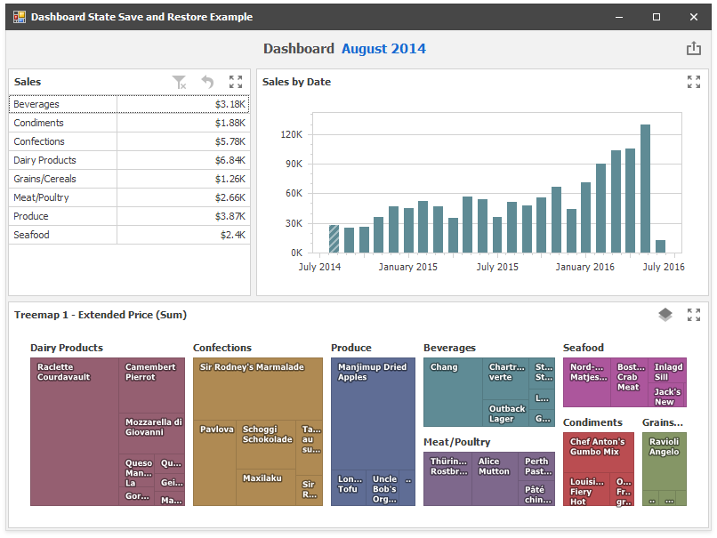

# How to Save and Restore the Dashboard State

This example demonstrates how to manage dashboard state to save and restore selected master filters values, current drill-down levels and other parameters such as Treemap layers.

When the form closes, the [DashboardViewer.GetDashboardState](https://docs.devexpress.com/Dashboard/DevExpress.DashboardWin.DashboardViewer.GetDashboardState) obtains a dashboard state object. It is serialized to XML and added to the **XElement** object stored in the [Dashboard.UserData](https://docs.devexpress.com/Dashboard/DevExpress.DashboardCommon.Dashboard.UserData). Subsequently the dashboard with the dashboard state data is saved to a file.

When the application starts, the DashboardViewer control loads the dashboard and the DashboardState object is deserialized in the [DashboardViewer.DashboardLoaded](https://docs.devexpress.com/Dashboard/DevExpress.DashboardWin.DashboardViewer.DashboardLoaded) event handler.

The dashboard state is restored using the [DashboardViewer.SetDashboardState](https://docs.devexpress.com/Dashboard/DevExpress.DashboardWin.DashboardViewer.SetDashboardState) method in the [DashboardViewer.SetInitialDashboardState](https://docs.devexpress.com/Dashboard/DevExpress.DashboardWin.DashboardViewer.SetInitialDashboardState) event handler.

**See also:**

* [ASPxDashboard - How to specify a default dashboard state in code](https://github.com/DevExpress-Examples/aspxdashboard-how-to-specify-a-default-dashboard-state-in-code-t513681)
* [ASP.NET MVC Dashboard - How to specify a default dashboard state in code](https://github.com/DevExpress-Examples/aspnet-mvc-dashboard-how-to-specify-a-default-dashboard-state-in-code-t586607)
* [ASP.NET Core Dashboard Control - How to specify a default dashboard state in code](https://github.com/DevExpress-Examples/aspnet-core-dashboard-control-how-to-specify-a-default-dashboard-state-in-code-t607138)
* [WPF Dashboard - How to Set the Initial Dashboard State](https://github.com/DevExpress-Examples/wpf-dashboard-how-to-set-initial-dashboard-state)
