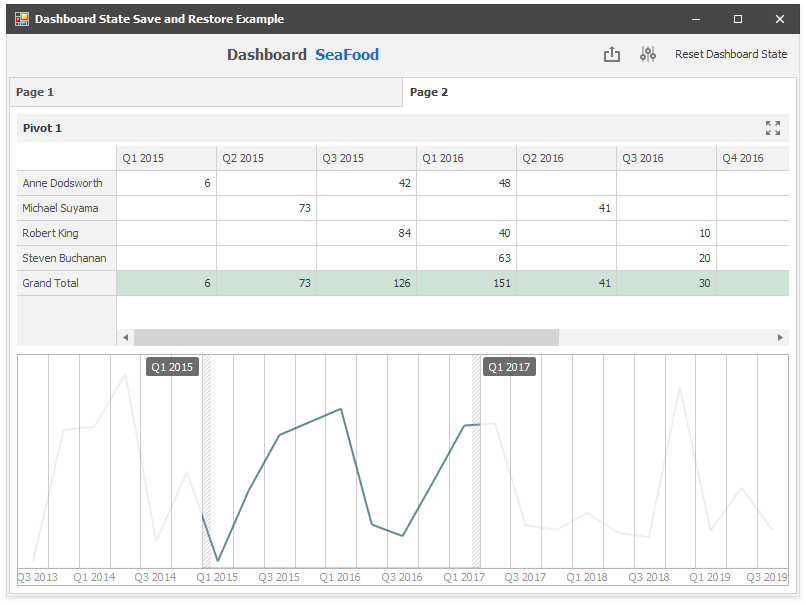

<!-- default badges list -->

<!-- default badges end -->

# Dashboard for WinForms - How to Save and Restore the Dashboard State

This example demonstrates how to manage dashboard state to save and restore user selections.

When the form closes, the [DashboardViewer.GetDashboardState](https://docs.devexpress.com/Dashboard/DevExpress.DashboardWin.DashboardViewer.GetDashboardState) obtains a dashboard state object. It is serialized to XML and added to the **XElement** object stored in the [CustomProperties](https://docs.devexpress.com/Dashboard/DevExpress.DashboardCommon.CustomProperties) collection. Subsequently the dashboard with the dashboard state data is saved to a file.

When the application starts, the DashboardViewer control loads the dashboard and the DashboardState object is deserialized in the **GetStateFromCustomProperty** method.

The dashboard state is restored using the **GetStateFromCustomProperty** method in the [DashboardViewer.SetInitialDashboardState](https://docs.devexpress.com/Dashboard/DevExpress.DashboardWin.DashboardViewer.SetInitialDashboardState) event handler.

You can click the **Reset Dashboard State** button to apply the [dashboard state](https://docs.devexpress.com/Dashboard/DevExpress.DashboardCommon.DashboardState) created at runtime.

<!-- default file list -->
## Files to look at

* [Form1.cs](./CS/WinFormsDashboard_DashboardState/Form1.cs) (VB: [Form1.vb](./VB/WinFormsDashboard_DashboardState/Form1.vb))
<!-- default file list end -->

## Documentation

- [Manage Dashboard State](https://docs.devexpress.com/Dashboard/400144/wpf-viewer/manage-dashboard-state)

## More Examples

* [ASPxDashboard - How to specify a default dashboard state in code](https://github.com/DevExpress-Examples/aspxdashboard-how-to-specify-a-default-dashboard-state-in-code-t513681)
* [ASP.NET MVC Dashboard - How to specify a default dashboard state in code](https://github.com/DevExpress-Examples/aspnet-mvc-dashboard-how-to-specify-a-default-dashboard-state-in-code-t586607)
* [ASP.NET Core Dashboard Control - How to specify a default dashboard state in code](https://github.com/DevExpress-Examples/aspnet-core-dashboard-control-how-to-specify-a-default-dashboard-state-in-code-t607138)
* [WPF Dashboard - How to Set the Initial Dashboard State](https://github.com/DevExpress-Examples/wpf-dashboard-how-to-set-initial-dashboard-state)
